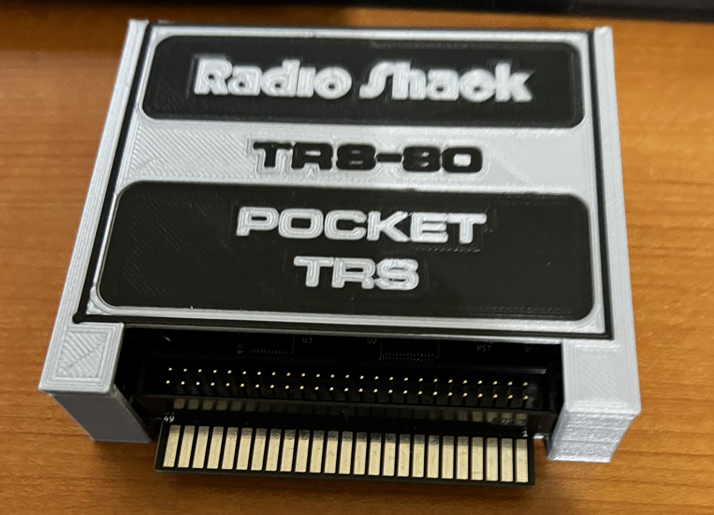

### These models are for the PocketTRS version 2.3b board.

##### Instructions:

The case print is a single model (PocketTRS v2.3b case bottom version 1). It uses M3x4 screws to secure the board.

The lid is printed using three models to get the logo inlays.

Print First - Lid Silver Text inlay
Print Second - Lid Black inlay
Print Third - Lid Main

<i>Please note that if you intend to use the logo for commercial purposes
the fonts are proprietary and you will need to purchase the font for the "POCKET TRS" lettering.  The font is Microsquare Bold Extended.</i>

To print the lid, download all three lid models. Align them in your slicer and then slice the models individual. In Cura, I deleted two of the models and then sliced each. Using Ctl-Z to undo the delete is the easiest way to get the three g-code files.

You will need to use a <b>z-hop</b> for the layers to avoid the head crashing into previously printed parts. I set it for .5mm and that seems to work fine. Z-hop plugin is available in the Cura marketplace.  

Also, if you have an ABL installed (BL-Touch, CR-Touch, etc) you need to offset the print from the bed center so the autolevel doesn't callibrate on top of the printed models.

Print the silver inlay text first, then the black inlay and finally the silver lid (or whatever color combo you prefer).

The lid is designed to snap onto the case. It's not a super tight fit, so feel free to make adjustments in the design.
